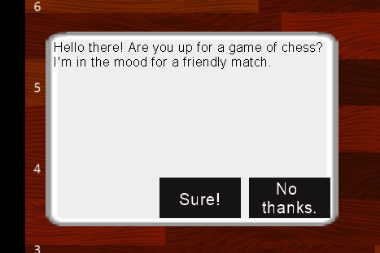
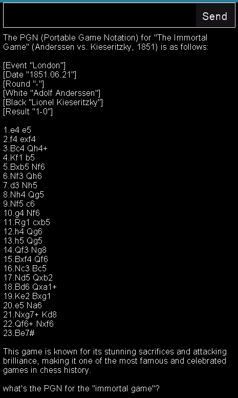

# Overview


ChatGPT almost seems a little too eager, but I'm willing to pit my (non-existent) chess skills against the world's most popular chatbot. Let the best man... er, thing win!

## About the game

Again, I've given myself two weeks to learn and develop a game that can be played reasonably well with ChatGPT as the engine. The game is two parts: an API to manage the database and calls to the OpenAI endpoint, and a "client-side" app created with the Arcade framework to keep track of the moves on a chess board.

### Why Arcade?

It's surprisingly easy to find chess games written with `pygame` on the web. (Yes, I looked.) So, to keep myself honest, I choose the framework that didn't have a tutorial on chess. However, given the rules of chess are quite challenging, I decided to rely on the `chess` package to track pieces, legal moves, and check/checkmate conditions. Don't worry, the front-end design is all mine.

Here's a link to my demo video, but read on if you want to learn more.

[Software Demo Video](http://youtube.link.goes.here)

## Chatting with ChatGPT



ChatGPT is not your typical AI chess opponent. The game is lousy, but the conversation is top-notch.

1. The first dialog of the game is sent directly from ChatGPT. It could be different each time you start the game.
2. ChatGPT is playing White and will make the first move of the game. I can say from experience that 'e2e4' is its absolute favorite.
3. You can chat at any time by typing something in the chat window and clicking the __Send__ button (or Ctrl+Enter). Whether you ask about the history of chess or about famous chess matches, ChatGPT will always try to be helpful.
4. Even though ChatGPT has the entire move history with every chat prompt, it sometimes forgets that it's playing a chess game. If this happens, you might need to step in and move a white piece to get the game going again.
5. You'll also notice that ChatGPT plays in an _aggressive_ beginner style. You should have no trouble winning the game.

One more thing. The chat history proceeds backwards down the screen. I did this to keep the most recent messages easily in view without scrolling.


> Chatting about a famous game.
>
>


## Multi-threading in Arcade

The Arcade folks provide a lot of examples of their API, but none that I could find explained how to take instructions from an external API while running a very active UI loop. So, after creating a version with long pauses where I was waiting for Django to respond, I decided to start my own message loop. This turned out to be only half the solution.

1. Arcade doesn't handle async methods. In order to send a message, it would need to start a request and receive an event when it was finished.
2. I decided to use `aiohttp` and `asyncio` to send my requests. I first created a new message loop for async messages using `asyncio` and got it running in its own thread.
3. Then, I could queue coroutines in the queue and process the HTTP response back into event objects. However, dispatching them directly to the UI thread was a bit trickier.
4. After rummaging around in the source code, I realized that Arcade was using `pyglet` to display and manage the UI message queues. I eventually discovered that all Windows in Arcade have their own message loops, so I just needed to find the right way to queue up my return event.
5. Voila, two-way, non-blocking communication between the API and the Arcade window!

```python
# EventSource.py
import arcade
import pyglet


class EventSource:
    r"""
    A class that can be used to dispatch events to the window from another thread.
    Note that you must register your custom events with pyglet before using this class.

    Example:

    .. code-block:: python

        ChessGame.register_event_type("on_player_move")  # Sent when player moves a piece

    """
    __dispatcher: pyglet.event.EventDispatcher = None

    @classmethod
    def set_dispatcher(cls, dispatcher: pyglet.event.EventDispatcher):
        """Set the dispatcher to the specified Window object."""
        cls.__dispatcher = dispatcher

    @classmethod
    def get_dispatcher(cls) -> pyglet.event.EventDispatcher:
        """Get the dispatcher."""
        return cls.__dispatcher or arcade.get_window()

    def __init__(self, name: str):
        """Create a new event dispatcher."""
        self.__name = name

    def __call__(self, *args):
        """Queue the event on the main message loop."""
        dispatcher = EventSource.get_dispatcher()
        if dispatcher is None:
            raise RuntimeError("No dispatcher set.")
        try:
            pyglet.app.platform_event_loop.post_event(dispatcher, self.__name, *args)
        except Exception as e:
            print(f"Error dispatching event {self.__name}: {e}")
            raise e

```

### How to Kill a Python Thread?

By the way, the API thread will continue to run after the main thread exits, unless you do something about it. However, what you need to do isn't immediately obvious.

Fortunately, Python will automatically clean up any threads you mark as a "daemon" like so:

```python
# See ChatGptApi.py
import asyncio
import threading


class ChatGptApi(object):
    def __init__(self):

        self.loop = asyncio.new_event_loop()

        ## Start a new thread that will exit when the main thread ends (daemon=True)
        threading.Thread(
            target=self.loop.run_forever, daemon=True, name="ChatGptApi"
        ).start()

```

## Sprite Rotation in Arcade

A static board isn't very exciting. Since I didn't have an entire art and design studio to animate the pieces in 3D, I opted for a "simple" rotation of the board after every turn. How un-simple this turned out to be.

1. First, I discovered that a `ShapeElementList` behaves a little like a `Sprite` in that it can be moved to a new position and rotated in space. I was a little surprised to find out that it's "center" wasn't just calculated from it's size, but rather from its origin of (0,0). So, in order to group the shapes around a center point, I had to draw them both left and right, above and below (0,0). Then, by setting the angle, I could rotate the board 360 degrees around a center point.
2. To calculate the location of pieces on the board, it was easier to create an "origin" property that would map mouse coordinates to board coordinates, no matter how it was rotated. You'll notice that these coordinates stay fixed in space, and do not rotate with the board.
3. And then I placed pieces on the board. At first I thought I could pin these sprites to the background, so they could rotate together. (No dice, pun intended.) I eventually learned that through the magic of sin/cos, there was a slick calculation to rotate a offset around a center point. (Arcade actually has a method for this, but I didn't find it until after I had implemented it myself, so I kept mine.)

```python
import arcade
import math


class RotatingSprite(arcade.Sprite):
    def __init__(
        self,
        filename: str,
        center: arcade.NamedPoint,
        offset: arcade.NamedPoint,
        scale: float = 1,
    ):
        super().__init__(filename, scale)
        self.position = (center.x + offset.x, center.y + offset.y)
        self.center = center
        self.offset = offset

    def rotate(self, angle_rad) -> None:
        rotated = self._rotate_point(self.offset, angle_rad)
        self.position = (self.center.x + rotated.x, self.center.y + rotated.y)

    def _rotate_point(
        self, offset: arcade.NamedPoint, angle_rad: float
    ) -> arcade.NamedPoint:
        cos_angle = math.cos(angle_rad)
        sin_angle = math.sin(angle_rad)
        new_x = offset.x * cos_angle - offset.y * sin_angle
        new_y = offset.x * sin_angle + offset.y * cos_angle
        return arcade.NamedPoint(new_x, new_y)
```

After all these pieces were in place, I could finally animate the board after each move. You can also use Shift+Left arrow to rotate the board at any time during game play. (This doesn't change the player's turn, just the perspective.)


## Keyboard shortcuts

| Action | Key |
| ---    | --- |
| Send chat message  | Ctrl+Enter |
| Start a new game   | Alt+R      |
| Quit the game      | Alt+Q      |
| Interrupt dragging | Esc        |
| Rotate the board   | Shift+Left |


# Development Environment

Here are the tools that I used to develop the app.

* Visual Studio Code with:
    * [Better Comments](https://marketplace.visualstudio.com/items?itemName=aaron-bond.better-comments)
    * [Black Formatter](https://marketplace.visualstudio.com/items?itemName=ms-python.black-formatter)
    * [Code Spell Checker](https://marketplace.visualstudio.com/items?itemName=streetsidesoftware.code-spell-checker)
    * [isort](https://marketplace.visualstudio.com/items?itemName=ms-python.isort)
    * [Pylance](https://marketplace.visualstudio.com/items?itemName=ms-python.vscode-pylance)
    * [Python](https://marketplace.visualstudio.com/items?itemName=ms-python.python)
    * [Python Environment Manager](https://marketplace.visualstudio.com/items?itemName=donjayamanne.python-environment-manager)
    * [Python Indent](https://marketplace.visualstudio.com/items?itemName=KevinRose.vsc-python-indent)
    * [Ruff](https://marketplace.visualstudio.com/items?itemName=charliermarsh.ruff)


* Python 3.11 with:
    * [arcade](https://pypi.org/project/arcade/) = "^2.6.17"
    * [chess](https://pypi.org/project/chess/) = "^1.10.0"
    * [Django](https://pypi.org/project/Django/) = "^4.2.5"
    * [django-ninja](https://pypi.org/project/django-ninja/) = "^0.22.2"
    * [mypy](https://pypi.org/project/mypy/) = "^1.5.1"
    * [openai](https://pypi.org/project/openai/) = "^0.28.1"
    * [poetry](https://pypi.org/project/poetry/) = "^1.6.1"
    * [python-dotenv](https://pypi.org/project/python-dotenv/) = "^1.0.0"

# Useful Websites

Here's a list of websites that I found helpful in this project.

* [Chess Notation](https://en.wikipedia.org/wiki/Chess_notation)
* [Portable Game Notation (PGN)](https://en.wikipedia.org/wiki/Portable_Game_Notation)
* [How To Code A Chess Game in Python](https://codewithmartin.io/articles/how-to-code-a-chess-game-in-python)
* [Arcade: A Primer on the Python Game Framework](https://realpython.com/arcade-python-game-framework/)
* [The Python Arcade Library (2.6.17)](https://api.arcade.academy/en/latest/)


# Future Work

Two weeks goes by fast. Here's the list of things that I wanted to do, but didn't get to do.

* __Animate moves made by the computer.__ It's sometimes hard to see what changed, but at least the move is documented in the chat window.
* __Open or replay saved games.__ Even though every move is saved to the database, I don't have the option of returning to an unfinished game.
* __Buttons and text in the UI.__ Keyboard shortcuts are nice, but it's hard to know they exist without the buttons to remind you.
* __Replay famous games.__ Load the PGN sequence and watch the game unfold.
* __Tournament games (countdown clocks, for starters...)__ It never intended to support everything that `chess` can do, but it would have been nice to see a score and count-down clocks, for example.
* __Full API support.__ If you open the Swagger page at http://localhost:8000, you'll see additional ways to interact with the API I wrote. Oh well... maybe next time!

~~ John Sudds