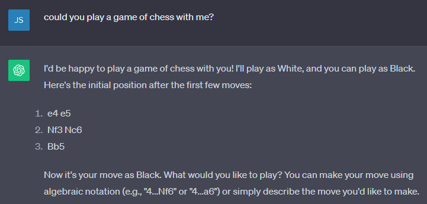

# Overview



ChatGPT almost seems a little too eager, but I'm willing to pit my (non-existent) chess skills against the world's most popular chatbot. Let the best man... er, thing win!

## About the game

Again, I've given myself two weeks to learn and develop a game that can be played reasonably well with ChatGPT as the engine. The game is two parts: an API to manage the database and calls to the OpenAI endpoint, and a "client-side" app created with the Arcade framework to keep track of the moves on a chess board.

Here's a link to my demo video, but read on if you want to learn more.

[Software Demo Video](http://youtube.link.goes.here)

## Multi-threading in Python

The Arcade folks provide a lot of examples of their API, but none that I could find explained how to take instructions from an external API while running a very active UI loop. So, after creating a version with long pauses where I was waiting for Django to respond, I decided to start my own message loop. This turned out to be only half the solution.

1. Arcade doesn't handle async methods. In order to send a message, it would need to start a request and receive an event when it was finished.
2. I decided to use `aiohttp` and `asyncio` to send my requests. I first created a new message loop for async messages using `asyncio` and got it running in its own thread.
3. Then, I could queue coroutines in the queue and process the HTTP response back into event objects. However, dispatching them directly to the UI thread was a bit trickier.
4. After rummaging around in the source code, I realized that Arcade was using `pyglet` to display and manage the UI message queues. I eventually discovered that all Windows in Arcade have their own message loops, so I just needed to find the right way to queue up my return event.
5. Voila, two-way, non-blocking communication between the API and the Arcade window!

```python
# EventSource.py
import arcade
import pyglet


class EventSource:
    r"""
    A class that can be used to dispatch events to the window from another thread.
    Note that you must register your custom events with pyglet before using this class.

    Example:

    .. code-block:: python

        ChessGame.register_event_type("on_player_move")  # Sent when player moves a piece

    """
    __dispatcher: pyglet.event.EventDispatcher = None

    @classmethod
    def set_dispatcher(cls, dispatcher: pyglet.event.EventDispatcher):
        """Set the dispatcher to the specified Window object."""
        cls.__dispatcher = dispatcher

    @classmethod
    def get_dispatcher(cls) -> pyglet.event.EventDispatcher:
        """Get the dispatcher."""
        return cls.__dispatcher or arcade.get_window()

    def __init__(self, name: str):
        """Create a new event dispatcher."""
        self.__name = name

    def __call__(self, *args):
        """Queue the event on the main message loop."""
        dispatcher = EventSource.get_dispatcher()
        if dispatcher is None:
            raise RuntimeError("No dispatcher set.")
        try:
            pyglet.app.platform_event_loop.post_event(dispatcher, self.__name, *args)
        except Exception as e:
            print(f"Error dispatching event {self.__name}: {e}")
            raise e

```

### How to Kill a Python Thread?

By the way, the API thread will continue to run after the main thread exits, unless you do something about it. However, what you need to do isn't immediately obvious.

Fortunately, Python will automatically clean up any threads you mark as a "daemon" like so:

```python
# See ChatGptApi.py
import asyncio
import threading


class ChatGptApi(object):
    def __init__(self):

        self.loop = asyncio.new_event_loop()

        ## Start a new thread that will exit when the main thread ends (daemon=True)
        threading.Thread(
            target=self.loop.run_forever, daemon=True, name="ChatGptApi"
        ).start()

```

## Rotation in Arcade


# Development Environment

{Describe the tools that you used to develop the software}


{Describe the programming language that you used and any libraries.}

# Useful Websites

Here's a list of websites that I found helpful in this project.

* [Chess Notation](https://en.wikipedia.org/wiki/Chess_notation)
* [Portable Game Notation (PGN)](https://en.wikipedia.org/wiki/Portable_Game_Notation)
* [How To Code A Chess Game in Python](https://codewithmartin.io/articles/how-to-code-a-chess-game-in-python)


# Future Work

{Make a list of things that you need to fix, improve, and add in the future.}
* Item 1
* Item 2
* Item 3